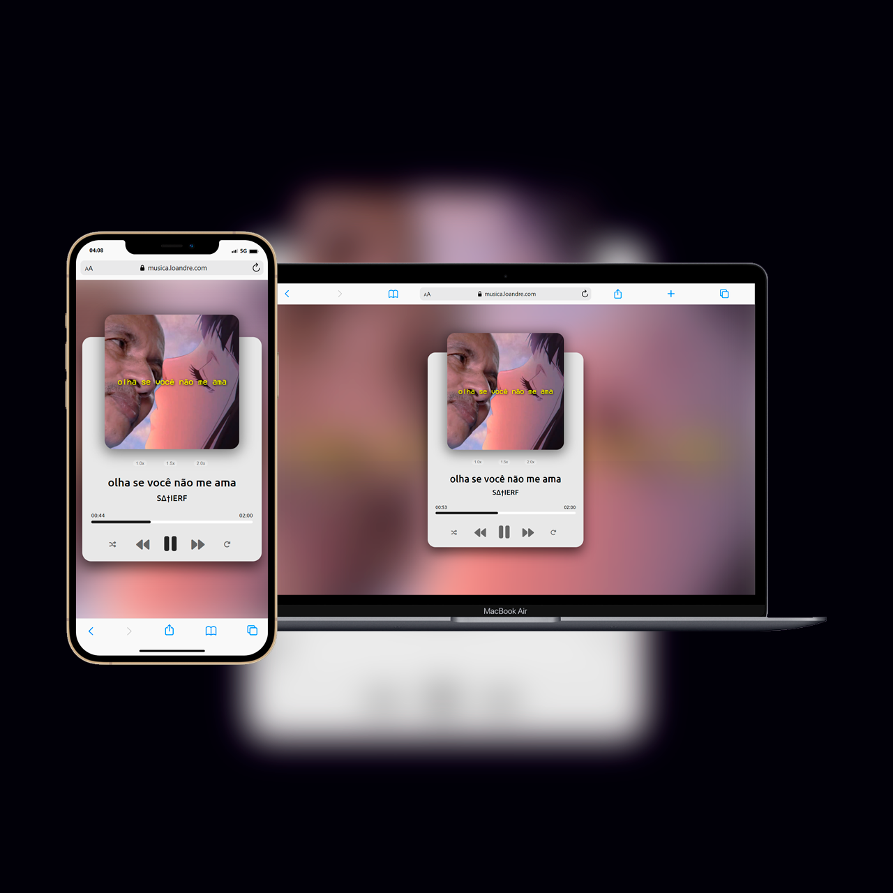

# Reprodutor de Música em JavaScript



Este é um reprodutor de música simples desenvolvido com JavaScript, HTML e CSS. Ele permite que os usuários reproduzam músicas a partir de uma lista de faixas, controlando a reprodução, pausa, avanço e retrocesso, além de exibir informações sobre a música em reprodução.

## Demonstração

Veja uma demonstração ao vivo do projeto [aqui](musica.loandre.com).

## Funcionalidades

- Reprodução e pausa de músicas.
- Avanço para a próxima música.
- Retorno para a música anterior.
- Exibição do título da música e informações do artista.
- Barra de progresso com controle de avanço e retrocesso.
- Capa do álbum em destaque.

## Como Usar

1. Clone este repositório em sua máquina local usando `git clone`:

   ```bash
   git clone https://github.com/loandre/music-player.git
